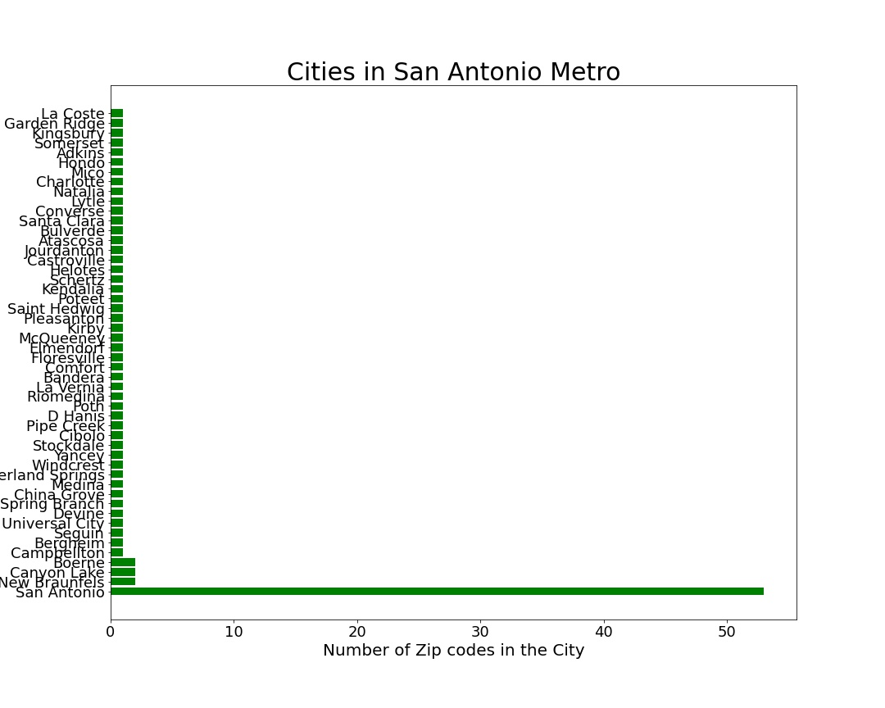
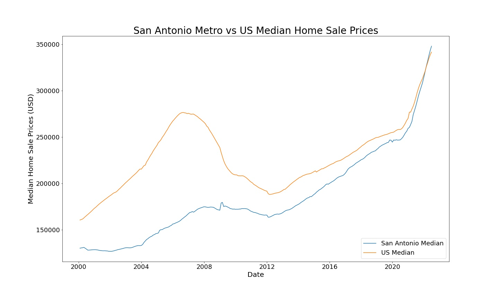
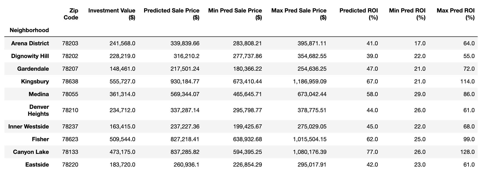
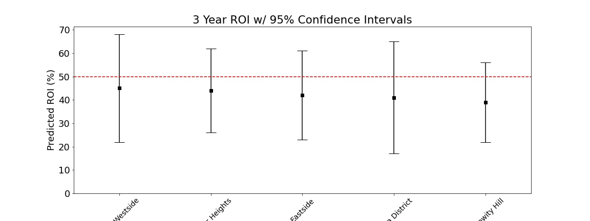
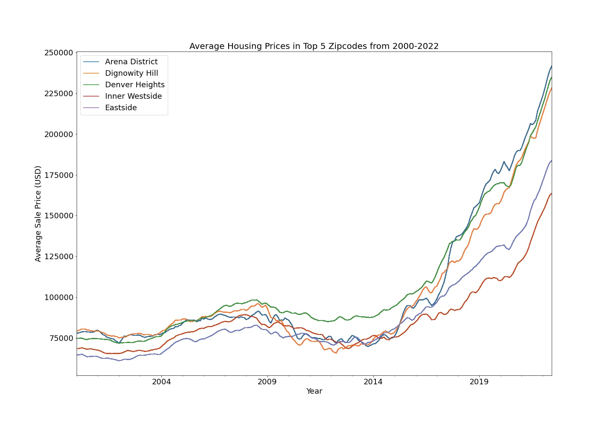

# Time Series Analysis of the San Antonio Metro Area

**Authors**: Melody Bass

## Overview

San Antonio is the seventh-most populous city in the United States. According to Wikipedia, it was the fastest-growing city among those in the top ten, at roughly 2% growth per year. [[1]](https://en.wikipedia.org/wiki/San_Antonio) According to recent data from DCInno.com, San Antonio, over the last 4 years, was among the nation's fastest-growing cities for college-educated Millennials, and was tops in Texas. [[2]](https://www.forbes.com/sites/scottbeyer/2016/04/30/when-it-comes-to-millennial-appeal-san-antonio-is-creeping-on-austin/?sh=6d8c68727c57)
San Antonio has been one of the hottest real estate markets in the country for many years. It is one of the best places to visit and has one of the fastest-growing economies in the country, driven by sectors such as military, tourism, health care, and insurance. The U.S. Armed Forces have numerous facilities in and around San Antonio; including Fort Sam Houston, Lackland Air Force Base, Randolph Air Force Base, Kelly Air Force Base, Camp Bullis, and Camp Stanley. [[1]](https://en.wikipedia.org/wiki/San_Antonio)
The aim of this project is to provide a detailed analysis of the real estate market in the San Antonio metropolitan area using time series modeling and price forecasting. Utilizing median monthly home sales prices contained in this [dataset](./data/zillow_2022.csv) prepared by Zillow, I will recommend the top 5 San Antonio metro zip codes to invest in to my client based on their specific needs. <br />

## Business Problem

A new real estate investment firm has hired me to identify the top 5 neighborhoods in the SA metro area that would give them the highest return on investment upon selling in 3 - 5 years. They want to start with short term investments in one of the most lucrative real estate markets in the country.  The company is most interested in safe investments to ensure they will have cash flow to reinvest when the time comes.

## Data Understanding

The dataset used for this analysis contains median monthly housing sales prices for 265 zip codes over the period of January 2000 through June 2022 as reported by Zillow and can be found [here](./data/zillow_2022.csv).  This is the most up to date information that is available on [Zillow](https://www.zillow.com/research/data/). These are median home values for the 33rd - 67th percentile of each zip code. Each row represents a unique zip code. Each record contains location info and median housing sales prices for each month.

There are 27280 rows and 277 variables:

* _RegionID_ - Unique index
* _RegionName_ - Unique Zip Code 
* _City_ - City in which the zip code is located
* _State_ - State in which the zip code is located
* _Metro_ - Metropolitan Area in which the zip code is located
* _CountyName_ - County in which the zip code is located
* _SizeRank_ - Numerical rank of size of zip code, ranked 1 through 34430
* _2000-01-31_ through _2022-06-30_ - median monthly housing sales prices from January 2000 through June 2022, that is 269 data points of monthly data for each zip code

Our business case is based solely in the San Antonio metro area, so I will filter the dataset down to only include the zip codes contained in the SA metro area.  There is a total of 105 zip codes in the greater metro area.

 <br />

There are several small cities with 1 zip code, while San Antonio itself contains 55 zip codes.

 <br />

The average median home value has surpased the national average median home value this year. 

 <br />

I chose to leave the crash after 2008 in my model to provide a more conservative forecast.  The SA metro area was not as affected by the crash as the rest of the US.

## SARIMAX Modeling

Before modeling, I selected 10 zip codes that have had the highest ROI % on home sales in the past 5 years. 

 <br />

### Seasonality

There is seasonality present in our data which we can clearly see when we perform seasonal decomposition.

 <br />

### Stationarity

Before modeling, I checked the stationarity of residuals for the metro area averaged.  The p-value of the Dickey-Fuller test was <0.05, which means that we accept our null hypothesis that the residuals are stationary.

 <br />

### Parameter Selection

While I looked at the autocorrelation and partial autocorrelation plots for each month, I ultimately ran gridsearch on my top 10 ROI zipcodes and found best parameters for each zipcode based on lowest AIC.  

### Forecasting

I used dynamic forecasting and projected median home sale values for each zip code 3 and 5 years into the future and based the current median home sale value as the entry point. With the current value and the 3 and 5 year projected values, I calculated ROI (return on investment).

   
  <br />

## Interpret Results

Following are the top 10 zipcode metrics:

 <br />

### Top 5 Zip Code Selection

I looked at the top 10 zip codes selecting for highest ROI, while also taking into account confidence intervals or uncertainty. The top projected zip codes were removed due to their confidence intervals being so uncertain (large). They also had a much higher entry point into the neighborhood than the recommended zipcodes.  My client is most interested in minimizing risk so this is the best strategy for us to utilize to ensure profits.

Our top 5 zip codes are 78237 - Inner Westside, 78210 - Denver Heights, 78220 - Eastside, 78203 - Arena District, and 78202 - Dignowity Hill. All 5 of these zip codes boast projected returns of 38% to 45%, and have great entry point prices ranging form 163k to 241k, far lower than the median value of the city. <br />

 <br />

Here is our top 5 zip codes average median home sale prices over time:

 <br />

## Conclusions

The top 5 zip codes ranked by highest return on investment (ROI) with the least amount of unpredictability and variation are:

* 78237: Inner Westside (lowest entry point)
* 78210: Denver Heights / Highland Park
* 78220: Eastside
* 78203: Arena District
* 78202: Dignowity Hill (safest investment - smallest variation) <br />

These 5 zip codes boast projected returns on a 3 year investment ranging from 38% to 45%, and 5 year returns from 64% to 75%! The entry price into these neighborhoods range from 163k to 241k, much lower than the average median price of the whole SA metro area at 348k.

It should be noted that there is a caveat to these low prices, the schools are below average in every one of these zip codes and the rate of crime is high. This is typical in big cities, and the schools typically improve as time goes on in neighborhoods with increasing home value. If any of these factors are a concern, I recommend taking a look at the other zip codes that were in our top 10 ROI. These other zip codes are in more desirable suburban areas that have good schools, but also come at a much higher entry point and more risk associated with the purchase.

Some next steps in this project include added exogenous factors to our model, such as the median income of each zip code over time. We could also do a facebook prophet model to compare the results of the sarimax model to.

## For More Information

Please review my full analysis in [my Jupyter Notebook](./notebook.ipynb) or my [presentation](./presentation.pdf).

For any additional questions, please contact **Melody Bass @ meljoy1099@gmail.com**

## Repository Structure

```
├── README.md                           <- The top-level README for reviewers of this project
├── student.ipynb                       <- Narrative documentation of analysis in Jupyter notebook
├── presentation.pdf                    <- PDF version of project presentation
├── data                                <- Both sourced externally and generated from code
└── images                              <- Both sourced externally and generated from code
```
